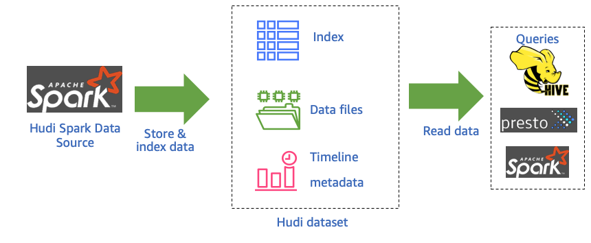

# How Hudi Works

When using Hudi with Amazon EMR, you can write data to the dataset using the Spark Data Source API or the Hudi DeltaStreamer utility. Hudi organizes a dataset into a partitioned directory structure under a basepath that is similar to a traditional Hive table. The specifics of how the data is laid out as files in these directories depend on the dataset type that you choose. You can choose either Copy on Write (CoW) or Merge on Read (MoR).

Regardless of the dataset type, each partition in a dataset is uniquely identified by its partitionpath relative to the basepath. Within each partition, records are distributed into multiple data files. Each action in Hudi has a corresponding commit, identified by a monotonically increasing timestamp known as an Instant. Hudi keeps a series of all actions performed on the dataset as a timeline. Hudi relies on the timeline to provide snapshot isolation between readers and writers, and to enable roll back to a previous point in time. For more information about the actions that Hudi records and the state of actions, see Timeline in the Apache Hudi documentation.

