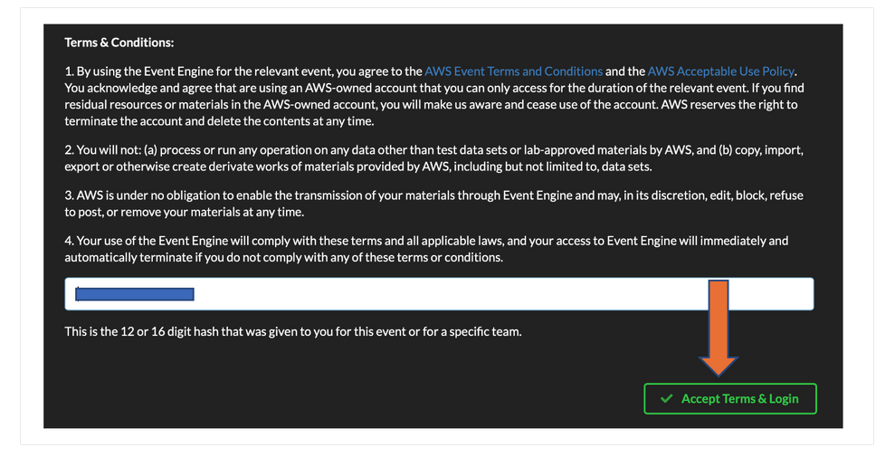
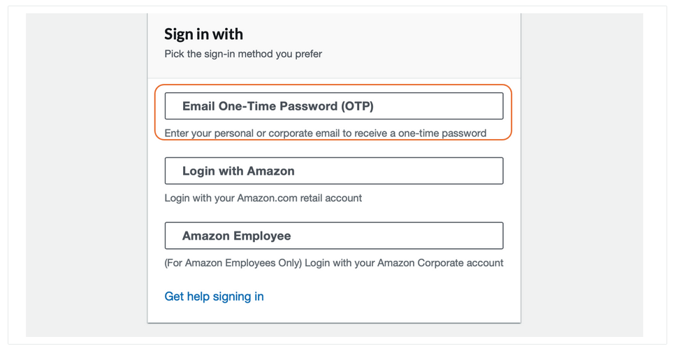
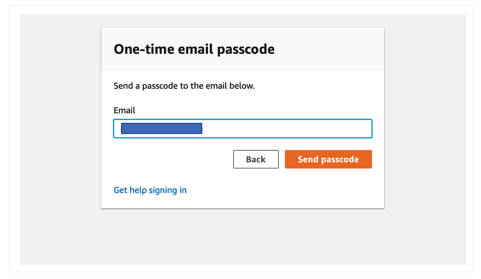
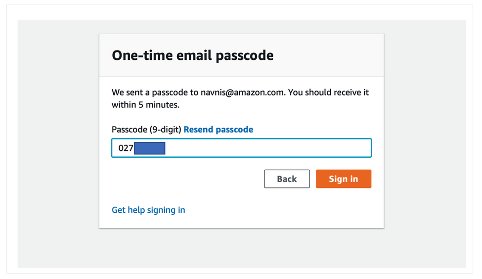
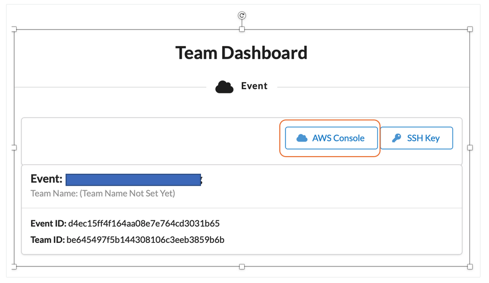
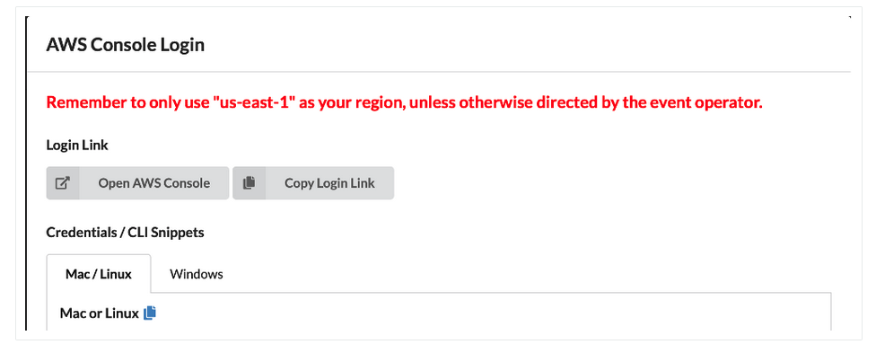

# How to Start?

If you are at an AWS hosted event (such as AWS re:Invent, AWS Summit, Immersions Day, on-site Workshop or other event hosted by AWS employees), you will be provided with a temporary Event Engine AWS account for the workshop. Please follow the [AWS Event](2-How-to-Start/2-aws-event?id=_1-aws-event) instructions to access your Event Engine AWS account.

If you are running this workshop by yourself, your account must have the ability to create new IAM roles and scope other IAM permissions. Please follow [Self Paced Labs](2-How-to-Start/3-self-paced-labs) instructions to prepare your AWS account.

## 1. AWS Event

You will be provided with an AWS account to run this workshop. The temporary account is being created using Event Engine. You will be provided a participant hash key to login to your temporary account.

Follow these steps to start using your account:
* Go to [AWS Event Engine Portal](https://dashboard.eventengine.run/)

* Enter the provided hash in the text box. The button on the bottom right corner changes to **Accept Terms & Login**. Click on that button to continue.
* Click on **Email One-Time Password (OTP)**; You also have option to use your personal Amazon.com uid and password (Note - Not your AWS account credentials)

* Provide your email address

* Provide the OTP you have received in your email

* Click **AWS Console** on the dashboard.

* Take the defaults and click on **Open AWS Console**. This will open AWS Console in a new browser tab.

Now, you should be on the AWS Console page of your workshop environment.
