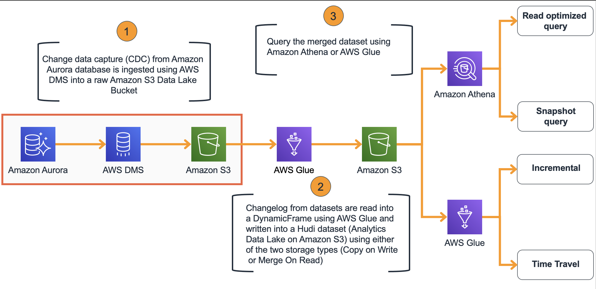

# Deploy the CloudFormation

In order to facilitate the workshop, we will be deploying a CloudFormation Template, that will generate the initial environment of the workshop. It will deploy an RDS Database, a DMS Instance and CDC Task, as well as creating the buckets for where we will be ingesting the incoming data and our Hudi Datasets. 

The diagram below presents the architecture you will deploy using the AWS CloudFormation template.

## 1. Deploy the CloudFormation

1. Sign in to the AWS Management Console and click the button to launch the glue-hudi-workshop AWS CloudFormation template.

2. The template launches in the EU West (Ireland), we will use this Region for the labs.
3. On the **Select Template** page, verify that you selected the correct template and choose **Next**.
4. On the **Stack name** text box, assign a name to your solution stack, *glue-hudi-workshop*.
5. Under **Parameters**, leave them as default:
6. Choose **Next**.
7. On the Options page, choose **Next**.
8. On the Review page, review and confirm the settings. Check the box acknowledging that the template will create AWS Identity and Access Management (IAM) resources.
9. Choose Create to deploy the stack.
You can view the status of the stack in the AWS CloudFormation console in the **Status** column. You should see a status of **CREATE_COMPLETE** in approximately 45 minutes.
