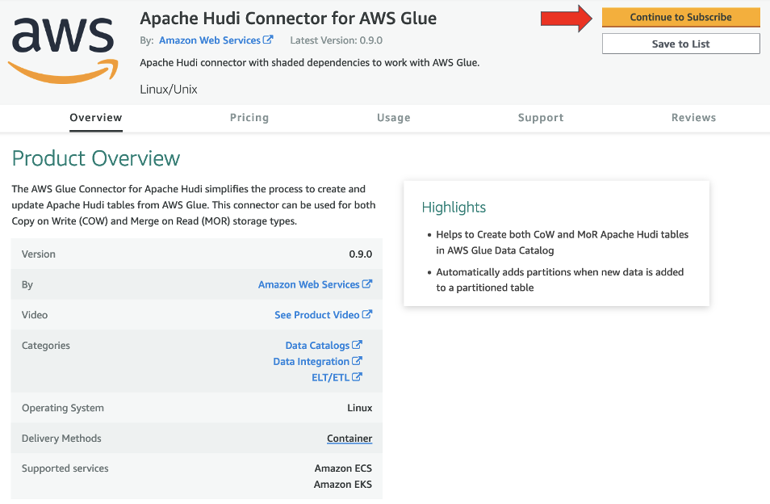
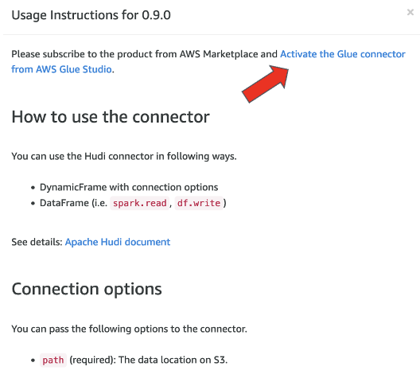

# Configure Hudi Connector

Now that we have finished deploying the CloudFormation Template, we will be creating an AWS Glue Custom Connector for Apache Hudi. Thanks to this connector is how we are going to be able to use Apache Hudi with AWS Glue. 

If you are running this workshop using an AWS Account from Event Engine, you will need to configure the Connector using the Hudi Jars. Luckily, those have already been uploaded to an S3 Bucket with the CloudFormation Template

## Custom Connector using Hudi Jars

For more information on these Hudi dependencies, check the [Hudi documentation](https://hudi.apache.org/docs/quick-start-guide/).

Now we will create an AWS Glue Custom Connector for Apache Hudi using these JAR files.

1. Go to the [AWS Glue console](https://console.aws.amazon.com/glue/) and click **AWS Glue Studio** on the left
2. Open the menu on the left and click Connectors
3. Click **Create custom connector**

4. Under **Connector S3 URL**, click **Browse S3** and select the Bucket with the name *hudi-workshop-s3bucket-random-string* and go to the *Hudi-Jars* folder and select the *hudi-spark3-bundle_2.12-0.9.0.jar* file and click **Choose**

5. Enter *hudi-connector* as **Name**
6. For **Connector type**, select *Spark*
7. Enter *org.apache.hudi* as **Class name**
8. Click **Create connector**

**Create connection for connector**

9. In the list of **Connectors**, open the created connector *hudi-connector* by clicking on its name.

10. At the top right, click **Create connection.**

11. Enter *hudi-connection* as **Name**, then click **Create connection**.

## Custom Connector using Hudi Connector for AWS Glue from the AWS Marketplace

If you doing this workshop in your own account, you can choose to use the Hudi connector from the AWS Marketplace. This makes it easier to develop and work with Apache Hudi, because the Connector already has the other Hudi Dependencies. If we were using the Hudi Jars, we will need to reference the rest of Jars as Extra Jars in our AWS Glue Job.

1. To start lets go back to **AWS Glue Studio** menu and click **Connectors**
2. Click on **Go to AWS Marketplace**

3. Select the **Apache Hudi Connector for AWS Glue**

4. At the right corner, click on **Continue to Subscribe**

Wait a few minutes while it deploys
5. Click on **Continue to Configuration**

6. Select the Fullfillment option menu
7. Select Glue 3.0 and the latest Software version

8. Click **Continue to Launch**

9. Click **Usage instructions**

10. Click **Activate the Glue connector from AWS Glue Studio**

11. Enter *hudi-marketplace-connection* as **Name**
12. Click Create connection and activate connector

You are now ready to start the Workshop!

