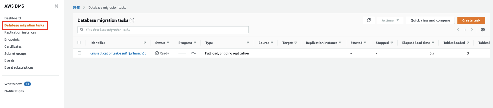
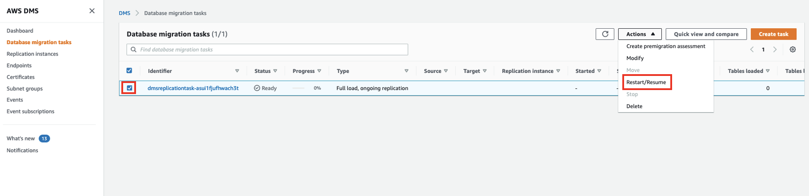
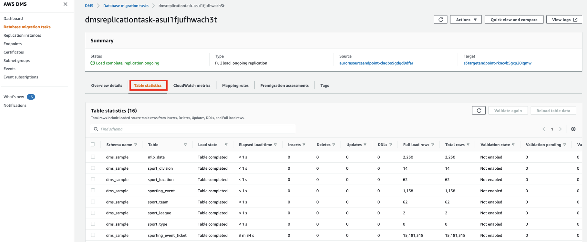
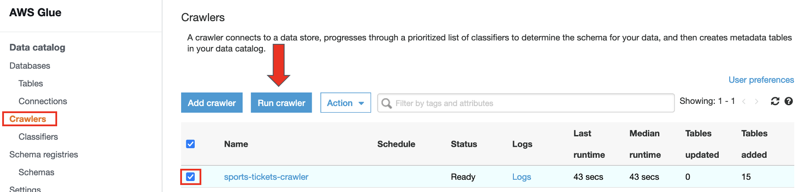
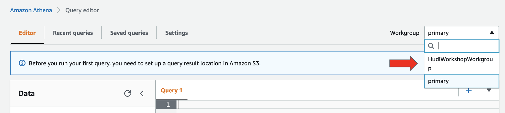

# Database Migation Service & AWS Glue

AWS Database Migration Service (AWS DMS) helps you migrate databases to AWS quickly and securely. The source database remains fully operational during the migration, minimizing downtime to applications that rely on the database. The AWS Database Migration Service can migrate your data to and from the most widely used commercial and open-source databases.

We can also use to replicate data from a Database to Amazon S3 using a CDC Task

## 1. Start CDC Task

All the necessary resources in order to use DMS have already been deployed using the CloudFormation Template.
* Replication Instance
* S3 Target Bucket
* DMS Source Endpoint to Aurora
* DMS Target Endpoint to S3
* CDC task that writes the files to Parquet and adds a timestamp column to the data.

We just need to start the CDC Task

1. First go to the [AWS Database Migration Service]([AWS Glue console](https://console.aws.amazon.com/dms/)
2. Click on **Database migration tasks**

3. Select the **DMS Replication Task**
4. Click on **Actions** and select **Restart/Resume**

5. Click the task, and go to the **Table Statistics** tab, here after a few minutes we can see how the DMS Task has started to ingest the data from Aurora in S3, as well as all the transactions that ocurring in the database (Inserts, Updates and Deletes)

> [!TIP]
> Check in **Endpoints** the S3targetendpoing so you can look at the configuration so we could write the data in S3 in Parquet format and adding an additional column with the timestamp of ingestion

## 2. Run AWS Glue Crawler

You can use a crawler to populate the AWS Glue Data Catalog with tables. This is the primary method used by most AWS Glue users. A crawler can crawl multiple data stores in a single run. Upon completion, the crawler creates or updates one or more tables in your Data Catalog. Extract, transform, and load (ETL) jobs that you define in AWS Glue use these Data Catalog tables as sources and targets. The ETL job reads from and writes to the data stores that are specified in the source and target Data Catalog tables.

Here we will be using the Glue Crawler to be able to query the data with Amazon Athena. Later on, we will be using the Glue Catalog to interact with our Glue ETL Job

1. Go to the [AWS Glue console](https://console.aws.amazon.com/glue/)
2. Click on **Crawlers** on the right
3. Select the Crawler and click **Run Crawler** (Wait 1 minute)

You should see that 15 tables have been added to the Glue Data Catalog.

These are the tables that we are currently replicating from Aurora into Amazon S3

## 3. Explore the data with Amazon Athena

Amazon Athena is an interactive query service that makes it easy to analyze data in Amazon S3 using standard SQL. Athena is serverless, so there is no infrastructure to manage, and you pay only for the queries that you run.

1. Go to the [Amazon Athena Console](https://console.aws.amazon.com/athena/)
2. On the top left select **Workgroup** and select the *HudiWorkshopWorkgroup*

3. Click Acknowledge
4. Click on the  **Saved queries** tab, and execute the *Updates In Sports Tickets*

* Follow [this deep link to create an IAM role with Administrator access](https://console.aws.amazon.com/iam/home#/roles$new?step=review&commonUseCase=EC2%2BEC2&selectedUseCase=EC2&policies=arn:aws:iam::aws:policy%2FAdministratorAccess)
* Confirm that AWS service and EC2 are selected, then click Next to view permissions.
* Confirm that AdministratorAccess is checked, then click Next to Tags.
* Just click Next to review.
* Enter mskworkshop-admin for the Name, and select Create Role

