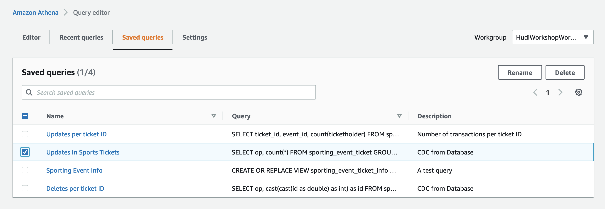
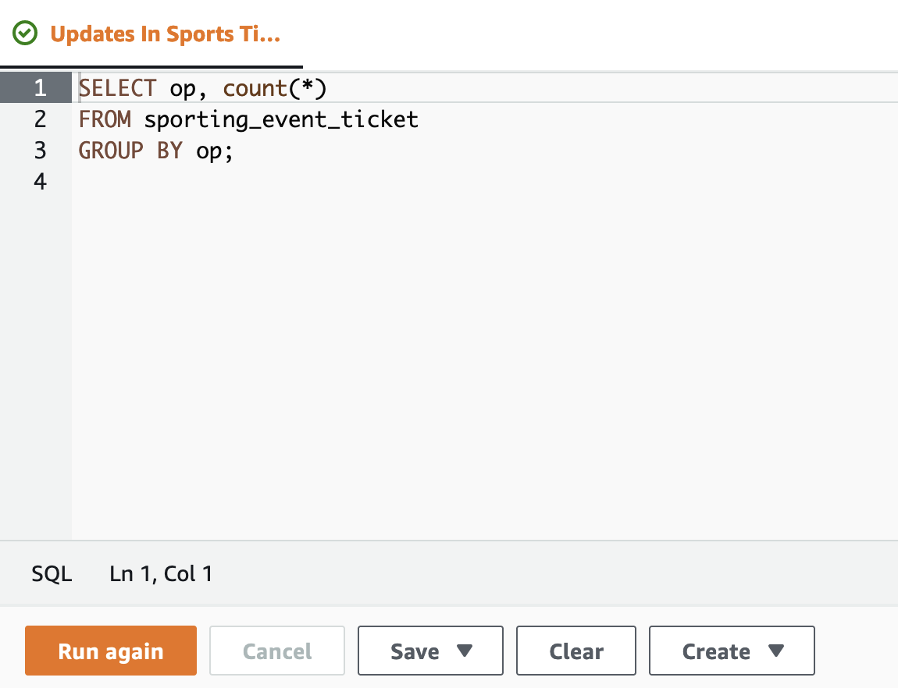
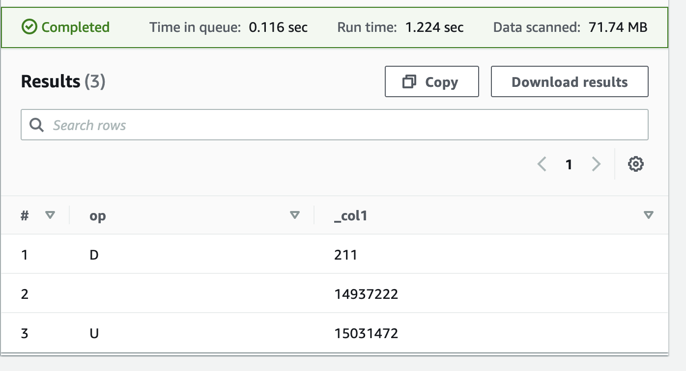
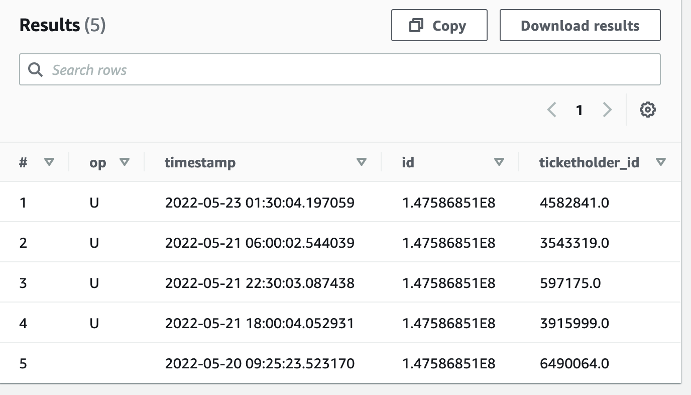
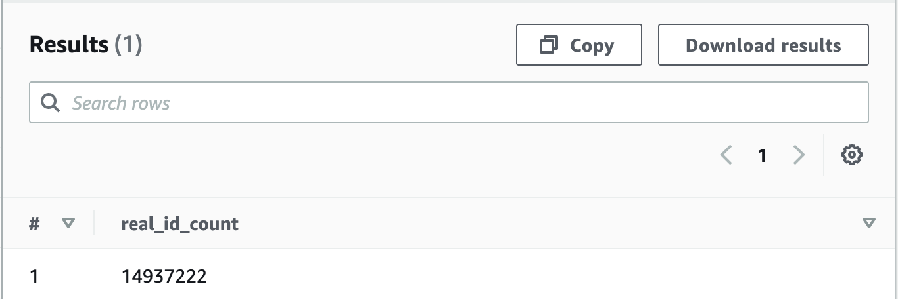

# Explore the data with Amazon Athena

## 1. Configure Amazon Athena

Amazon Athena is an interactive query service that makes it easy to analyze data in Amazon S3 using standard SQL. Athena is serverless, so there is no infrastructure to manage, and you pay only for the queries that you run.

1. Go to the [Amazon Athena Console](https://console.aws.amazon.com/athena/)
2. On the top left select **Workgroup** and select the *HudiWorkshopWorkgroup*

3. Click Acknowledge
4. Click on the  **Saved queries** tab, and execute the *Updates In Sports Tickets* Query

5. Run the Query



We can see from the results that there is a column *op*. This refers to the type of operation that the Replication task from CDC is sending to Amazon S3
* U = Updates
* I = Inserts
* D = Deletes
* Null = First migration before starting the replication of all the transactions

## 2. Analyze the data

Lets execute some queries in order to see if we have any updates in our Sporting Event Ticket Tables

1. Lets execute a query in order to select a sport ticket which has had multiple updates. The updates we expect from this table refer to having that ticket been purchased or transfered to another ticketholder ID.

``` 
select id, count(*) from sporting_event_ticket group by id having count(*) > 4 limit 1;
``` 

2. We select the id from the results and execute the next query. Replace the id with the result from the previous query
``` 
select op,timestamp,id,ticketholder_id from sporting_event_ticket where id = 1.45250511E8;
``` 

Alternatively you could choose to run only this query:
``` 
select op,timestamp,id,ticketholder_id from 
sporting_event_ticket where id = 
(select id from sporting_event_ticket group by id having count(*) > 4 limit 1);
``` 



We can see that for the same ID we have an initial row with a null in the op column. 

We can also see that we have multiple rows that may be Updates or Deletes, with different timestamps and different Ticket Holders.

3. Finally we are going to execute some queries in order to see how many rows we should have in our table, compared to what we have in our Data Lake with all the different transactions

``` 
select count(distinct(id)) as real_id_count from sporting_event_ticket;
``` 


And compare with 

``` 
select count(id) as total_id_count from sporting_event_ticket;
``` 


As we can see, if we were to consume this data in order to gather insights, we would be dealing with a huge amount of duplicates, because we are currently not performing any upserts in our Data Lake.

Here is where Apache Hudi is going to help us perform this transformations in order to really have a Data Lake that reflects the latest version of our database.

