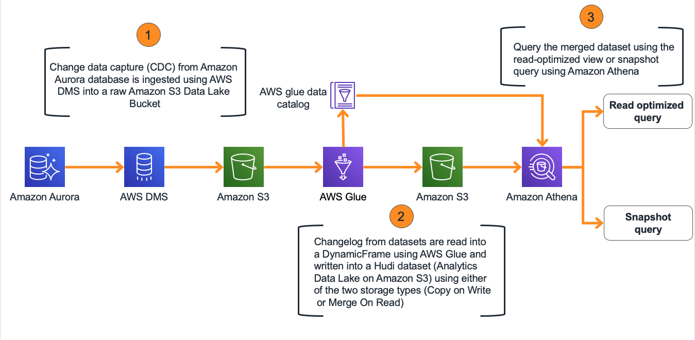

# Incremental Data Lakes: Apache Hudi with AWS Glue Workshop

Following is the architecture of the data pipeline that you will be working with. It starts with data pulled from an OLTP database such as Amazon Aurora using Amazon Database Migration Service (DMS). DMS deposits the data files into an S3 datalake Raw Tier Bucket in parquet format. DMS task is configured so it performs a full load of the data as well as change data captures into the S3 Bucket. Additionally, we are adding a timestamp column to the tables to keep track of the transactions in the database. Data is read then by an AWS Glue Job and written as an Apache Hudi dataset to the Hudi Data Lake Bucket. Hudi can write the data in two different storage types (Copy on Write and Merge on Read) and exposes the data to be queried in three different views (Read Optimized, Snapshot, Incremental). As part of this workshop, we will be writing the data using both storage types and perform Read Optimized and Snapshot Queries using Amazon Athena.

